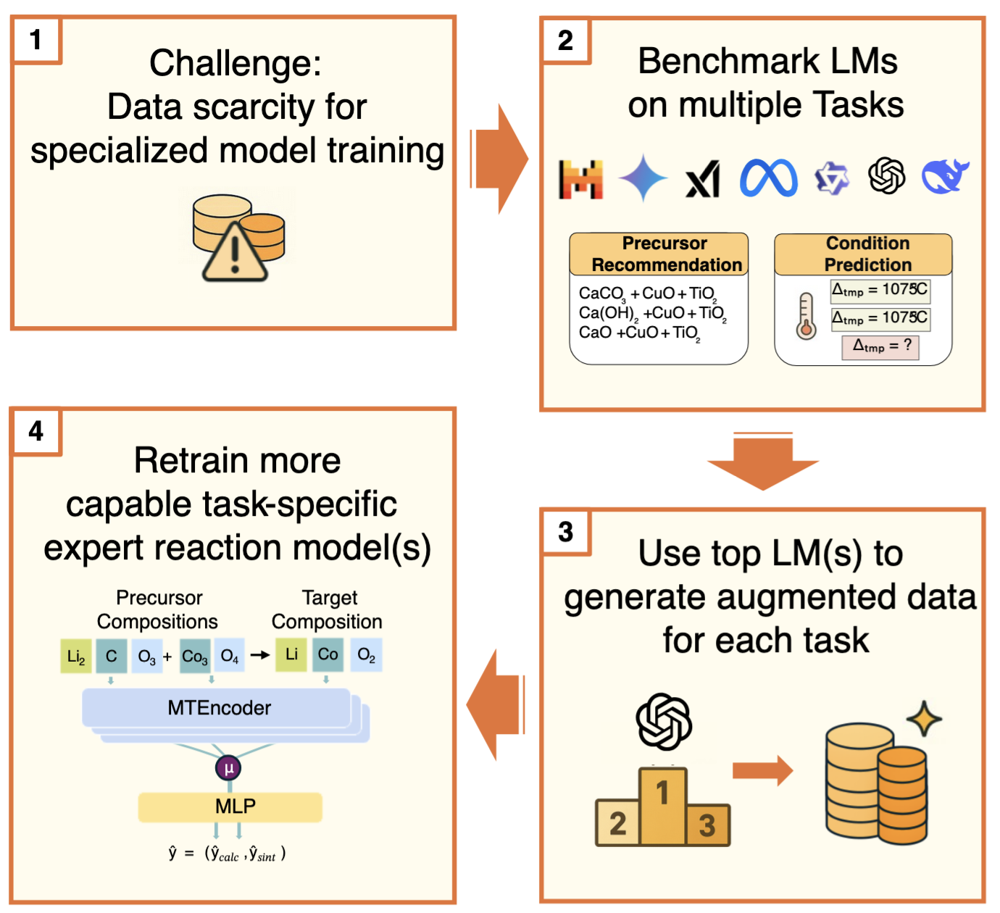
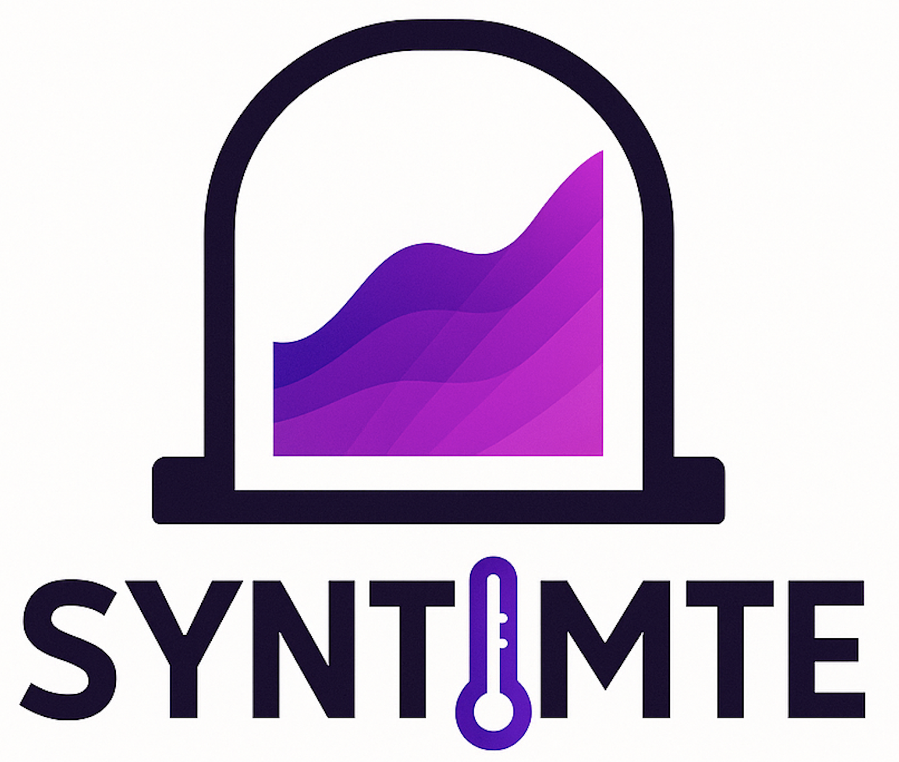

# Welcome

  <h2>
    🚀 This is the codebase to "Language Models Enable Data-Augmented
Synthesis Planning for Inorganic Materials" 🤖
  </h2>
  
<table style="border: none; border-collapse: collapse;">
  <tr>
    <td align="center" width="33%" style="border: none; padding: 20px;">
      <a href="https://github.com/janik-j/APIRetroSynthesisFinal" target="_blank">
        
        
LM-Dataset Generation

      </a>
    </td>
    <td align="center" width="33%" style="border: none; padding: 20px;">
      <a href="https://github.com/Thorben010/SyntMTE" target="_blank">
        
        
SyntMTE

      </a>
    </td>
    <td align="center" width="33%" style="border: none; padding: 20px;">
      <a href="https://huggingface.co/datasets/thor1/LLMForge" target="_blank">
        
        
Dataset on HuggingFace

      </a>
    </td>
  </tr>
</table>

## About

The code to our project is split into two repositories. For the LM-based dataset generation click on the left. For the SyntMTE model on the right.
